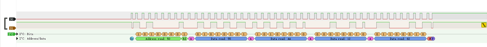

# 简介

&emsp;&emsp;ScdTool提供一种通过C#脚本控制FT232H/FT2232H/FT4232H发出`I2C`/`JTAG`激励的功能。

# 函数列表

## 共用

### GetDeviceList

```c#
string[] GetDeviceList();
```

### Open

```c#
FT_STATUS Open(uint idx);
```

### Close

```c#
FT_STATUS Close();
```

### 注意

&emsp;&emsp;在调用`Open`函数之前必须先调用`GetDeviceList`函数。

## I2C

### I2CInit

```c#
FT_STATUS I2CInit(double Baudrate = 100e3);
```

###  I2CSetBaudrate

&emsp;&emsp;设置波特率，单位:HZ，范围:1MHZ-1KHZ。

```c#
FT_STATUS I2CSetBaudrate(double Baudrate);
```

### I2CWrite

```c#
FT_STATUS I2CWrite(byte SlvAddr, byte[] TxBuff, int Length);
```

### I2CWriteWitoutStop

```c#
FT_STATUS I2CWriteWitoutStop(byte SlvAddr, byte[] TxBuff, int Length);
```

&emsp;&emsp;调用该函数发送数据时，当数据发送完成后，FT232H不会发出`Stop`信号，这个特性用于有些需要`restart`的地方。

### I2CRead

```c#
byte[] I2CRead(byte SlvAddr, int Length);
```

### Demo

* 代码:`i2c_base.cs`

```c#
using System;
using System.IO;
using static System.Threading.Thread;

/*定义一些变量*/
ScdFtd2xx Ftdi;
string[] list;
FT_STATUS Status;
byte[] RxBuff;
byte[] TxBuff;

/*创建一个Ftdi设备*/
Ftdi = new ScdFtd2xx();
/*获取设备列表*/
list = Ftdi.GetDeviceList();
/*打印列表*/
for(int i=0;i<list.Length;i++)
{
    Console.WriteLine("{0}:{1}",i,list[i]);
}
/*打开设备(需要根据打印的设备列表确定打开是设备)*/
Status = Ftdi.Open(1);
if(Status == FT_STATUS.FT_OK)
{
    Console.WriteLine("打开设备成功");
}
/*初始化I2C模式*/
Ftdi.I2CInit();
/*I2C模式写数据*/
TxBuff = new byte[] {0x01,0x00,0x55,0xAA,0x12,0x62 };
Ftdi.I2CWrite(0x50,TxBuff,6);
/*延时10ms,等待EEPROM数据完成写操作*/
Sleep(10);
/*读数据(先写地址,再读数据)*/
TxBuff = new byte[]{0x01, 0x00};
Ftdi.I2CWriteWitoutStop(0x50,TxBuff,2);
RxBuff = Ftdi.I2CRead(0x50, 4);
/*打印数据*/
for(int i=0;i<RxBuff.Length;i++)
{
    Console.WriteLine("{0:X}",RxBuff[i]);
}
/*关闭设备*/
Ftdi.Close();
```

* 命令行输入指令

```
ScdTool.exe .\i2c_base.cs
```

* 打印输出

```
0:FT0000A
1:FT0000B
2:FT0000C
3:FT0000D
打开设备成功
55
AA
12
62
```

* 写操作时序图


* 写读数据地址时序图


* 读数据时序图



## JTAG

### JTAGInit

```C#
FT_STATUS JTAGInit(double Baudrate = 100e3);
```

### JTAGReset

```c#
FT_STATUS JTAGReset();
```

&emsp;&emsp;调用该函数时FT232H会发出8个CLK，同时保持`TMS`信号为高，使JTAG状态机进入复位状态。

### JTAGWriteReadIR

```c#
byte[] JTAGWriteReadIR(int IRLength,byte[] TxBuff);
```

&emsp;&emsp;`IRLength`为`IR`寄存器bit宽度。

&emsp;&emsp;`TxBuff`格式为：低Byte、低bit存放`IR`寄存器低位，高Byte、高bit存放`IR`寄存器高位。譬如`TxBuff[0]`的bit0存放`IR`寄存器的bit0。

&emsp;&emsp;返回的byte数组格式也是低Byte、低bit存放`IR`寄存器低位，高Byte、高bit存放`IR`寄存器高位。

### JTAGWriteReadDR

```c#
byte[] JTAGWriteReadDR(int DRLength, byte[] TxBuff);
```

&emsp;&emsp;`DRLength`为`DR`寄存器bit宽度。

&emsp;&emsp;`TxBuff`格式为：低Byte、低bit存放`DR`寄存器低位，高Byte、高bit存放`DR`寄存器高位。譬如`TxBuff[0]`的bit0存放`DR`寄存器的bit0。

&emsp;&emsp;返回的byte数组格式也是低Byte、低bit存放`DR`寄存器低位，高Byte、高bit存放`DR`寄存器高位。

### Demo

* 代码

```c#
using System;
using System.IO;
using static System.Threading.Thread;

/*定义一些变量*/
ScdFtd2xx Ftdi;
string[] list;
FT_STATUS Status;
byte[] RxBuff;
byte[] TxBuff;

/*创建一个Ftdi设备*/
Ftdi = new ScdFtd2xx();
/*获取设备列表*/
list = Ftdi.GetDeviceList();
/*打印列表*/
for(int i=0;i<list.Length;i++)
{
    Console.WriteLine("{0}:{1}",i,list[i]);
}
/*打开设备(需要根据打印的设备列表确定打开是设备)*/
Status = Ftdi.Open(1);
if(Status == FT_STATUS.FT_OK)
{
    Console.WriteLine("打开设备成功");
}
/*初始化JTAG模式*/
Ftdi.JTAGInit();
/*读写IR寄存器*/
TxBuff = new byte[]{0x55,0xAA};
RxBuff = Ftdi.JTAGWriteReadIR(12,TxBuff);
for(int i=0;i<RxBuff.Length;i++)
{
    Console.WriteLine("{0:X}",RxBuff[i]);
}
/*关闭设备*/
Ftdi.Close();
```

* 命令行输入指令

```
ScdTool.exe .\jtag_base.cs
```


* 打印输出

```
0:FT0000A
1:FT0000B
2:FT0000C
3:FT0000D
打开设备成功
55
A
```

* 时序图

