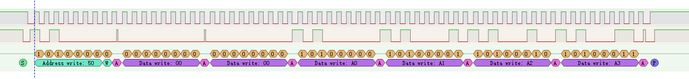
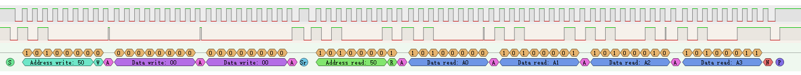

# 简介

&emsp;&emsp;ScdTool提供通过C#、C语言脚本控制FT232/CH341发出 I2C / JTAG 激励的功能。  

# 支持设备列表

|       | IIC  | JTAG |
| ----- | :--- | ---- |
| FT2XX | √    | √    |
| CH341 | √    | ×    |

# 命令

## -lsiic

描述:打印所有支持IIC协议的设备。

示例:

```powershell
>ScdTool.exe -lsiic
IIC设备列表:
-------|-------------------------------------------
Number | Name
-------|-------------------------------------------
 0000  | 210249981877
 0001  | \\?\usb#vid_1a86&pid_5512#8&240e69e3&0&4#{5446f048-98b4-4ef0-96e8-27994bac0d00}
```

## -v

描述:打印当前软件版本。

示例:

```
>ScdTool.exe -v
版本信息:
    Version:0.6
    Compile time:12/26/2021 11:42:31 PM
```

# C Script

## IIC协议

### 函数概览

| 函数名称                                                     | 描述                                     |
| ------------------------------------------------------------ | ---------------------------------------- |
| `int IIC_Open(char* Name);`                                  | 打开IIC设备                              |
| `int IIC_Close();`                                           | 关闭IIC设备                              |
| `int IIC_ReadByte(uint8_t SlvAddr, uint8_t* Data);`          | 读一个Byte                               |
| `int IIC_Read(uint8_t SlvAddr, uint8_t* Buff, int Length);`  | 读`Length`个Byte                         |
| `int IIC_WriteByte(uint8_t SlvAddr, uint8_t Data);`          | 写一个Byte                               |
| `int IIC_Write(uint8_t SlvAddr, uint8_t* Buff, int Length);` | 写`Length`个Byte                         |
| `int IIC_WriteWithRead(uint8_t SlvAddr, uint8_t* TxBuff, int TxLength, uint8_t* RxBuff, int RxLength);` | 写`TxLength`个Byte后再读`RxLength`个Byte |
| `int IIC_SetBaudrate(double Baudrate);`                      | 设置波特率                               |
| `int IIC_GetDeviceList(char[][IIC_DEVICE_NAME_MAX_LEN] DeviceList,uint32_t MaxNumber);` | 获取设备列表                             |
| `int IIC_CreateDeviceObject(void);`                          | 生成设备对象                             |
| `int IIC_SetContext(int DeviceObject);`                      | 设置IIC设备对象上下文                    |
| `int IIC_GetContext(void);`                                  | 获取IIC设备对象上下文                    |

### API详解

#### IIC_Open

```c
int IIC_Open(char* Name);
```

描述:通过设备名打开一个IIC设备。

参数:

* `char *Name`:设备名。

返回值:

* `int`:大于或等于0表示打开设备成功，小于0表示打开设备失败。

#### IIC_Close

```c
int IIC_Close(void);
```

描述:关闭设备。

参数:无。

返回值:

* `int`:大于或等于0表示关闭设备成功，小于0表示关闭设备失败。

#### IIC_ReadByte

```c
int IIC_ReadByte(uint8_t SlvAddr, uint8_t* Data);
```

描述:读取一个Byte。

参数:

* `uint8_t SlvAddr`:IIC Slave地址。
* `uint8_t* Data`:读取到的数据存放地址。

返回值:

* `int`:大于或等于0表示读取成功，小于0表示读取失败。

#### IIC_Read

```c
int IIC_Read(uint8_t SlvAddr, uint8_t* Buff, int Length);
```

描述:读取一组数据。

参数:

* `uint8_t SlvAddr`:IIC Slave地址。
* `uint8_t* Buff`:读取到的数据存放地址。
* `int Length`:读取到的数据的数量。

返回值:

* `int`:大于或等于0表示读取成功，小于0表示读取失败。

#### IIC_WriteByte

```c
int IIC_WriteByte(uint8_t SlvAddr, uint8_t Data);
```

描述:写入一个Byte。

参数:

* `uint8_t SlvAddr`:IIC Slave地址。
* `uint8_t Data`:需要写入的数据。

返回值:

* `int`:大于或等于0表示写入成功，小于0表示写入失败。

#### IIC_Write

```c
int IIC_Write(uint8_t SlvAddr, uint8_t* Buff, int Length);
```

描述:写入一组数据。

参数:

* `uint8_t SlvAddr`:IIC Slave地址。
* `uint8_t* Buff`:写入数据的存放地址。
* `int Length`:写入数据的数量。

返回值:

* `int`:大于或等于0表示写入成功，小于0表示写入失败。

#### IIC_WriteWithRead

```c
int IIC_WriteWithRead(uint8_t SlvAddr, uint8_t* TxBuff, int TxLength, uint8_t* RxBuff, int RxLength);
```

描述:写入一组数据后，立即读取一组数据，写入数据与读取数据之间使用repeat start(without stop)。

参数:

* `uint8_t SlvAddr`:IIC Slave地址。
* `uint8_t* TxBuff`:写入数据的存放地址。
* `int TxLength`:写入数据的数量。
* `uint8_t* RxBuff`:读取到的数据存放地址。
* `RxLength`:读取数据的数量。

返回值:

* `int`:大于或等于0表示写入/读取成功，小于0表示写入/读取失败。

#### IIC_SetBaudrate

```c
int IIC_SetBaudrate(double Baudrate);
```

描述:设置IIC的波特率。

参数:

* `double Baudrate`:波特率(scl的频率),单位:HZ。

返回值:

* `int`:大于或等于0表示设置成功，小于0表示设置失败。

#### IIC_CreateDeviceObject

```c
int IIC_CreateDeviceObject(void);
```

描述:生成设备对象,用于多IIC Master场景,单IIC Master场景无需使用该函数。

参数:无。

返回值:

* `int`:不等于0则表示生成的设备对象的句柄，等于0表示生成设备对象失败。

#### IIC_SetContext

```c
int IIC_SetContext(int DeviceObject);
```

描述:设置设备上下文,用于多IIC Master场景,单IIC Master场景无需使用该函数。

参数:

* `int DeviceObject`:设备对象句柄。

返回值:

* `int`:大于或等于0表示设置成功，小于0表示设置失败。

#### IIC_GetContext

```c
int IIC_GetContext(void);
```

描述:获取设备上下文,用于多IIC Master场景,单IIC Master场景无需使用该函数。

参数:无。

返回值:

* `int`:获取到的设备上下文句柄。

### 示例

#### 单设备场景

##### 代码

```c
#include "stdio.h"
#include "stdint.h"
#include "scdtool.h"
#include "string.h"
/*eeprom_write*/
void eeprom_write(uint16_t addr,uint8_t *data,uint32_t length)
{
    uint32_t i;
    uint8_t buff[2048];
    buff[0] = (addr >> 8) & 0xFF;
    buff[1] = (addr >> 0) & 0xFF;
    memcpy(&buff[2],data,length);
    IIC_Write(0x50,buff,length + 2);
}
/*eeprom_read*/
void eeprom_read(uint16_t addr,uint8_t *data,uint32_t length)
{
    uint8_t buff[2];
    buff[0] = (addr >> 8) & 0xFF;
    buff[1] = (addr >> 0) & 0xFF;
    IIC_WriteWithRead(0x50,buff,2,data,length);
}
/*main*/
int main(void)
{
    int i;
    uint8_t txbuff[4] = {0xA0,0xA1,0xA2,0xA3};
    uint8_t rxbuff[4];
    IIC_Open("\\\\?\\usb#vid_1a86&pid_5512#8&240e69e3&0&4#{5446f048-98b4-4ef0-96e8-27994bac0d00}");
    eeprom_write(0x00,txbuff,4);
    Sleep(100);
    eeprom_read(0x00,rxbuff,4);
    for(i=0;i<4;i++)
    {
        printf("rxbuff[%d] = %02x\r\n",i,rxbuff[i]);
    }
    return 0;
}
```

##### 运行结果

* 控制台:

```powershell
> ScdTool.exe main.c
rxbuff[0] = a0
rxbuff[1] = a1
rxbuff[2] = a2
rxbuff[3] = a3
```

* `eeprom_write`:



* `eeprom_read`:



#### 多设备场景

##### 代码

```c
/*暂无*/
```

##### 运行结果

```c
/*暂无*/
```

## 其它常用函数

### Sleep

```c
void Sleep(int delay);
```

描述:延时函数。

参数:

`int delay`:延时时间长度,单位:ms。

返回值:无。

&emsp;&emsp;除了上述函数之外，脚本解析器还支持常用C语言标准库函数，譬如:`fopen`、`fwrite`、`fread`、`printf`、`scanf`、`malloc`等函数，这写函数在某些特定场景(譬如需要读取磁盘上的bin文件通过i2c发送出去)会用到。

## 命令行传参

&emsp;&emsp;ScdTool支持命令行向脚本传递参数。当脚本需要接受命令行参数时，main函数需要使用如下形式:

```c
int main(int argc, char **argv)
{
    return 0;
}
```

&emsp;&emsp;其中`argc`为参数数量，`argv`为参数数组，参数格式均为字符串。

### 示例

* 代码:

```c
#include "stdio.h"

int main(int argc, char **argv)
{
    int i;
    for(i=0;i<argc;i++)
    {
        printf("argv[%d]=%s\r\n",i,argv[i]);
    }
    return 0;
}
```

* 运行结果:

```powershell
> .\ScdTool.exe main.c arg_in_1 arg_in_2 arg_in_3
argv[0]=-
argv[1]=arg_in_1
argv[2]=arg_in_2
argv[3]=arg_in_3
```

注意：参数需要在c文件的后面指定,否则参数不会传入到脚本,而是由ScdTool内部处理。

## 自定义协议

&emsp;&emsp;暂未预留自定义协议接口，后面再加入。

## 语法限制

&emsp;&emsp;ScdTool使用的C语言解释器为picoc，该解释器没有实现全部C89的语法，目前已知不支持的语法有：

* 不支持函数指针。
* 不支持结构体初始化。
* 不支持位域。

- 不支持自定义类型(typedef)作为返回值类型。

- 不支持const关键字。
- 不支持数组传参的写法（参数变量后面加方括号），如果需要对数组传参，需要使用指针。

# CS Script

&emsp;&emsp;CS脚本的API函数请见《ScdTool UserGuide_V0.2.pdf》。